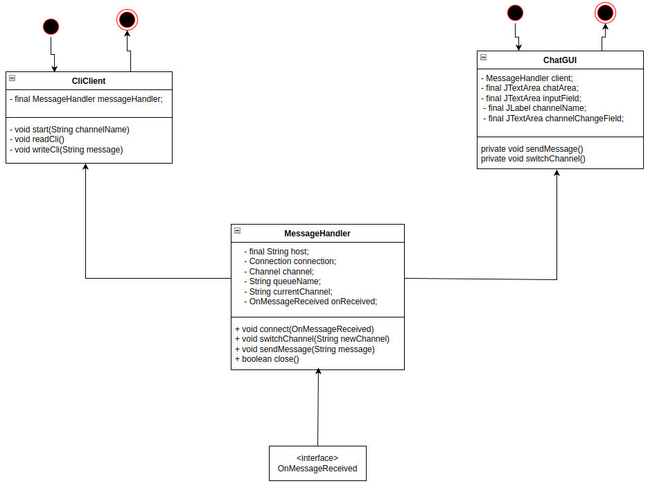

# Многоканальный чат

## Обзор системы
Mногоканальный консольный чат с использованием RabbitMQ в качестве брокера сообщений.

**Oсобенности:**

* Поддержка множества изолированных чат-каналов
* Отсутствие истории сообщений (только live-обмен)
* Автоматическое создание новых каналов

## Поддерживаемые команды
Cli:
1. ```[Message]``` - отправить сообщение
2. ```!switch [channelName]``` - переключится на другой 
3. exit - завершение приложения

Gui:
1. отправка сообщения
2. переключение на другой канал

## Архитектура
Приложение состоит из 3 классов:
1. MessageHandler 
    * Ядро всего приложения
    * Обрабатывает запросы 
    * Создает новые каналы 
    * Подключается к существующим
    * Присылает и получает сообщения
2. CliClient
   * Консольное приложение
   * Внутри хранит экземпляр MessageHandler 
   * Принимает ввод от пользователя, передает сообщение MessageHandler 
   * Печатает сообщение в консоль, полученное от MessageHandler
3. ChatGUI
   * Консольное приложение
   * Внутри хранит экземпляр MessageHandler
   * Принимает ввод от пользователя, передает сообщение MessageHandler
   * Печатает сообщение в консоль, полученное от MessageHandler

## Диаграмма классов
